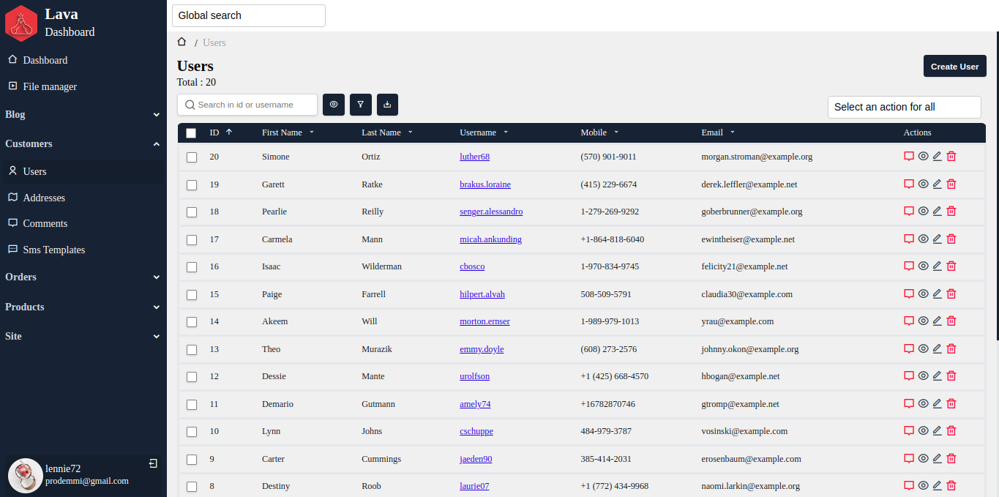

# dashboard

## Install
`composer require prodemmi/laravel-panel`

## Contributing
Please see [CONTRIBUTING](CONTRIBUTING.md) for details.

## License
The MIT License (MIT). Please see [License File](/LICENSE.md) for more information.